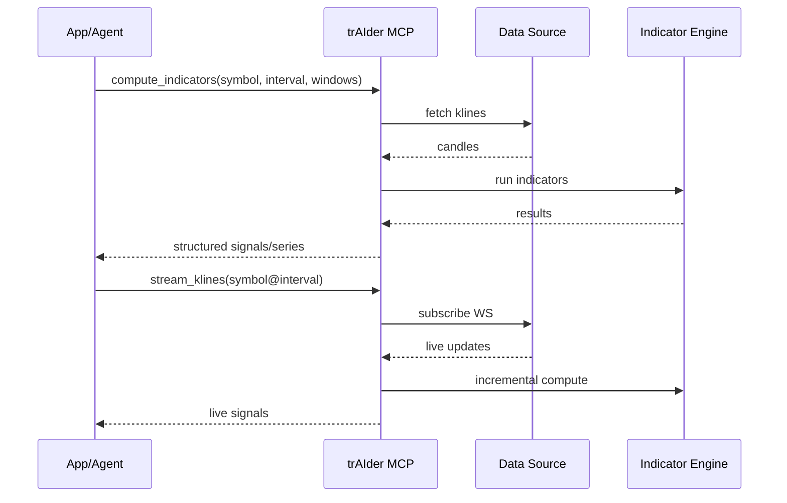

# trAIder — AI‑Ready Technical Analysis Toolkit


TypeScript-first technical analysis indicators, a faithful port of Python `ta` with modern DX for Node.js and browsers. Pure functions, strict types, tree-shakable, with streaming calculators for real-time apps.

What is trAIder?
- 🚀 Enterprise‑grade technical analysis for TypeScript — built for AI workflows, modern web apps, and trading automation.
- 🧠 Combines a comprehensive indicator engine, real‑time streaming calculators, React UI components (incoming), and an MCP Server (incoming) to power LLM‑driven agents and dashboards.

Why teams choose trAIder
- 📦 Comprehensive indicators: trend, momentum, volatility, volume — aligned with Python ta
- ⚡ Real‑time: streaming calculators for low‑latency updates
- 🧩 React UI (incoming): drop‑in overlays/panes for rapid dashboards
- 🤖 MCP Server (incoming): Model Context Protocol to expose tools to AI agents
- ✅ Quality: parity‑tested vs fixtures, ~98% coverage, strict types, tree‑shakable builds
- 🌐 Browser + Node: zero native deps; fast deque‑based rolling windows

Install (Core)
```bash
npm install tats
```

Links & Technical Docs
- 📘 Technical Analysis Engine: DOCUMENTATION-TA.md
- 🧩 React UI Components: DOCUMENTATION-REACT.mc
- 🤝 MCP Server (Model Context Protocol): DOCUMENTATION-MCP.md
```ts
Core package name is currently `tats` while the repo is trAIde. We’ll publish under the trAIder scope when packaging is finalized.

const close = [/* numbers */];
const high = [/* numbers */];
const low  = [/* numbers */];
const vol  = [/* numbers */];

// Trend
const macd   = trend.macd(close, 26, 12);
const signal = trend.macdSignal(close, 26, 12, 9);
const diff   = trend.macdDiff(close, 26, 12, 9);

// Momentum
const rsi14 = momentum.rsi(close, 14);
const stoch = momentum.stochastic(high, low, close, 14, 3);
const kRSI  = momentum.stochRsiK(close, 14, 3);
const dRSI  = momentum.stochRsiD(close, 14, 3, 3);

// Volatility
const { m: kcM, h: kcH, l: kcL } = volatility.keltnerChannel(high, low, close, 20, 10);
const ui14 = volatility.ulcerIndex(close, 14);
const bbUp = volatility.bollingerHbandIndicator(close, 20, 2); // 1 when > upper band

// Volume
const obv  = volume.onBalanceVolume(close, vol);
const cmf  = volume.chaikinMoneyFlow(high, low, close, vol, 20);
const cho  = volume.chaikinOscillator(high, low, close, vol, 3, 10);

// Returns
const ret  = returns.dailyReturn(close);

// Streaming (EMA example)
const ema = new calculators.EmaCalc(12);
const emaSeq = close.map(c => ema.update(c));
```

Quality & Parity
- 🧪 Tests mirror Python `ta` fixtures; tight tolerances
- 📈 Coverage: ~98% statements/lines, 100% functions, ~89% branches
- 📚 Full surface and examples: docs/API.md

Indicator Coverage (selected)
- Trend: SMA, EMA, MACD (+signal/diff), TRIX, Mass Index, Ichimoku (+display helpers), STC, DPO, KST, Aroon, Vortex, PSAR
- Momentum: RSI, Stochastic, StochRSI (+%K/%D), KAMA, TSI, Ultimate Oscillator, Williams %R, Awesome Osc, PPO/PVO
- Volatility: ATR, Bollinger (mavg/high/low/width/%B + cross indicators), Keltner (original + EMA/ATR), Donchian, Ulcer Index
- Volume: OBV, ADL, CMF, Force Index, Ease of Movement (+SMA), VPT (+smoothed), NVI, MFI, VWAP, Chaikin Oscillator
- Others: Daily/Log/Cumulative Returns

Architecture at a glance

```mermaid
flowchart LR
  subgraph Data[Data Sources]
    B1[Binance REST]:::api
    B2[Binance WS]:::api
    O[Other Feeds]:::api
  end

  subgraph Engine[trAIder Core Engine]
    I[Indicators]:::core
    S[Streaming Calculators]:::core
  end

  subgraph UI[React UI (incoming)]
    C[Chart Components]:::ui
    H[Headless Hooks]:::ui
  end

  subgraph MCP[MCP Server (incoming)]
    T1[compute_indicators]:::mcp
    T2[stream_klines]:::mcp
  end

  Data --> Engine
  Engine --> UI
  Data --> MCP
  MCP --> Agents[AI Agents / LLMs]:::ai
  UI --> Dashboards[Dashboards & Apps]:::app
  Engine --> Apps[Node/Browser Apps]:::app

  classDef core fill:#0a84ff22,stroke:#0a84ff,color:#0a84ff
  classDef ui fill:#8e8e9322,stroke:#8e8e93,color:#8e8e93
  classDef mcp fill:#34c75922,stroke:#34c759,color:#34c759
  classDef api fill:#ff9f0a22,stroke:#ff9f0a,color:#ff9f0a
  classDef ai fill:#bf5af222,stroke:#bf5af2,color:#bf5af2
  classDef app fill:#ffd60a22,stroke:#ffd60a,color:#9a6e00
```

MCP Server interaction



Docs
- 📘 API reference: docs/API.md
- 🔬 Engine details: DOCUMENTATION-TA.md
- 🧩 React library: DOCUMENTATION-REACT.mc
- 🤝 MCP server: DOCUMENTATION-MCP.md

Roadmap (Near‑Term)
- ✅ Finalize parity sweep and defaults vs Python `ta`
- 🧩 React UI component library (overlays/panes, hooks)
- 🤝 MCP Server to integrate indicators with AI agents
- 📊 Demo app: historical + live Binance (REST + WebSocket)
- 📚 Typedoc site, examples, strategy cookbook

Contributing
- Run lint, typecheck, tests:
  ```bash
  npm run lint && npm run typecheck && npm test
  ```
- PRs welcome for additional fixtures, indicators, and docs.

License
- MIT
