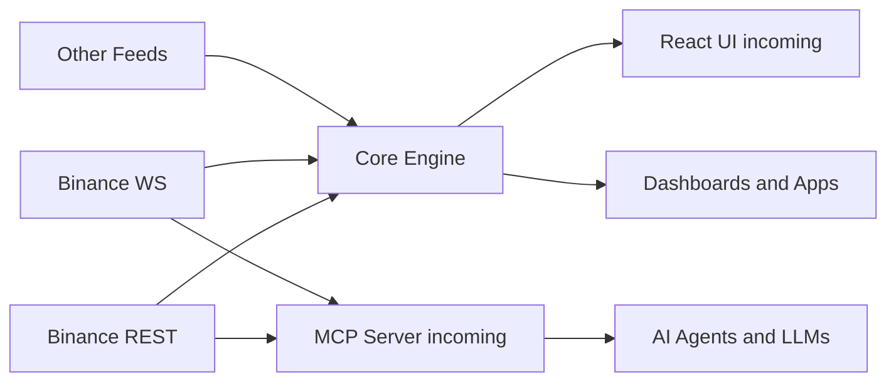
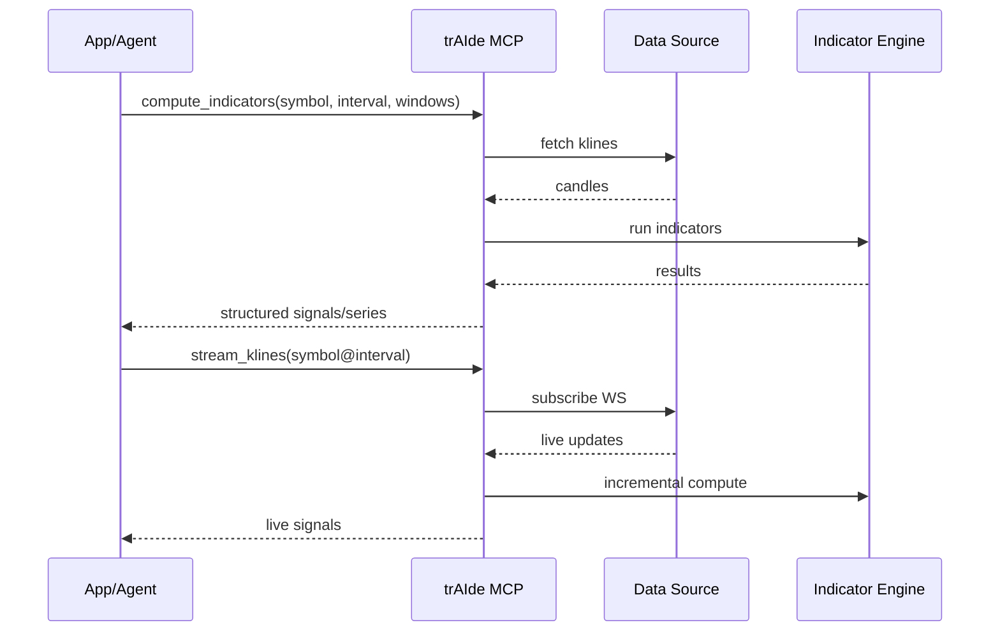

# Traide — Real‑Time Technical Analysis, Built for Builders

Traide is a modern TA stack: a TypeScript indicator engine, a streaming MCP server, and a stunning React UI. It’s the fastest way to go from “idea” to “live, shareable chart with real data”.

Why Traide (in plain English)
- Show, don’t tell: live charts, real streams, zero yak‑shaving.
- Ship fast: batteries‑included UI, server, and core indicators.
- Grow with you: start with a demo, scale to real users and agents.

What you get
- 📦 Indicators you trust: parity with Python ta, tested end‑to‑end.
- ⚡ Real‑time streams: server‑side deltas for buttery‑smooth charts.
- 🖥️ Beautiful UI: glass‑morphic, minimal, production‑ready shell.
- 🤖 Agent‑ready: MCP server for AI tools and automation.
- ✅ Quality‑driven: tests, types, coverage, and docs.

Try It Locally (2 commands)
1) Install deps: `npm install`
2) Start UI + Stream Server: `npm run dev:start`

Open: `http://localhost:65001`

If your environment uses a different host/IP, click the top‑right “Endpoint” pill and paste your MCP URL (e.g., `http://172.72.72.2:65000`).

What’s Inside (at a glance)
- Core TA library (TypeScript) with streaming calculators
- MCP server (REST + SSE) for live Binance data and metrics
- React app with a live hero chart, minimal workspace, and endpoint control

Quality & Parity
- 🧪 Tests mirror Python `ta` fixtures; tight tolerances
- 📈 Coverage: ~98% statements/lines, 100% functions, ~89% branches
- 📚 Full surface and examples: docs/API.md

Indicator Coverage (selected)
- Trend: SMA, EMA, MACD (+signal/diff), TRIX, Mass Index, Ichimoku (+display helpers), STC, DPO, KST, Aroon, Vortex, PSAR
- Momentum: RSI, Stochastic, StochRSI (+%K/%D), KAMA, TSI, Ultimate Oscillator, Williams %R, Awesome Osc, PPO/PVO
- Volatility: ATR, Bollinger (mavg/high/low/width/%B + cross indicators), Keltner (original + EMA/ATR), Donchian, Ulcer Index
- Volume: OBV, ADL, CMF, Force Index, Ease of Movement (+SMA), VPT (+smoothed), NVI, MFI, VWAP, Chaikin Oscillator
- Others: Daily/Log/Cumulative Returns

Architecture

How the Server Helps

Docs & Links
- Core TA engine: DOCUMENTATION-TA.md
- React UI plan/spec: SPEC-UI.md, SPEC-REACT-COMP.md
- MCP server: DOCUMENTATION-MCP.md

Production‑Ready Next Steps
- One‑click deploy (UI on Vercel; MCP on your infra)
- Google/X auth, saved layouts, watchlists, and scanners
- More streaming signals and presets out of the box

Roadmap
- 📈 More signals and strategy presets
- 🔐 Auth + personal workspaces (Google/X)
- 🧪 Playgrounds, scanners, and shareable links
- 📦 Docker images and deploy guides

Contributing
- `npm run lint && npm run typecheck && npm test`
- PRs welcome for indicators, docs, and UI polish.

License
- MIT

Stargazers over time

