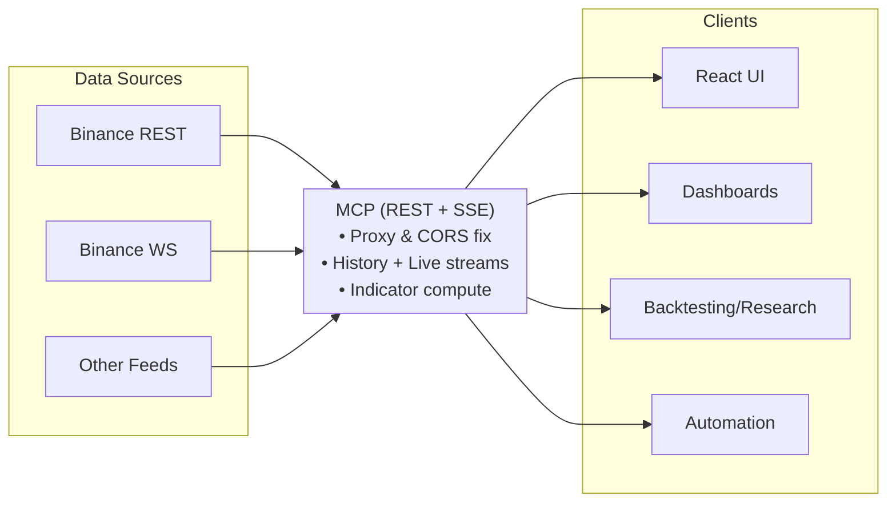

Built for builders. trAIde is a practical TA stack for automated strategies, algo backtesting, research, and dashboards. It combines a tested TypeScript indicator engine, a minimal MCP server (REST + SSE), and a production‑ready React UI. The focus: slash time‑to‑signal and avoid glue work.

Who it’s for
- Quant devs and researchers building automated strategies and backtests.
- Teams needing a reliable indicator core with real‑time streams.
- Builders who want a beautiful demo today and a scalable path tomorrow.

Why it’s useful
- Faster from idea to insight: history backfill + live SSE ticks for immediate charts.
- No CORS headaches: UI talks to MCP via a same‑origin proxy.
- Tooling‑friendly shape: stable endpoints and structured events for integrations.
- Reliable math: parity with Python ta and high test coverage.

What’s included
- Core TA engine (TypeScript): broad indicator coverage, fixtures, and utils.
- MCP mini server: `/health`, `/klines` (history), `/stream/klines` (SSE); CORS handled.
- React UI: glass minimal hero chart, ChartWorkspace, endpoint control, status/latency.
- Runner CLI: start/stop/status/logs/nuke; port preflight; `.env` support.
- Docker: images for UI + MCP with a compose file.

Install
- `npm install`

Operate (at a glance)
- Use the runner to launch UI and MCP together (defaults: UI 65001, MCP 65000).
- Open the UI and, if needed, set your MCP URL via the top‑right “Endpoint” pill.
- For containerized runs, build with the provided Dockerfiles and use the compose file.

System view

Docs
- TA engine: DOCUMENTATION-TA.md, docs/API.md
- UI spec: SPEC-UI.md, SPEC-REACT-COMP.md
- MCP: DOCUMENTATION-MCP.md

Contributing
- Lint, typecheck, and tests are expected before PRs.
- PRs welcome for indicators, docs, UX, and tooling.

License
- MIT
