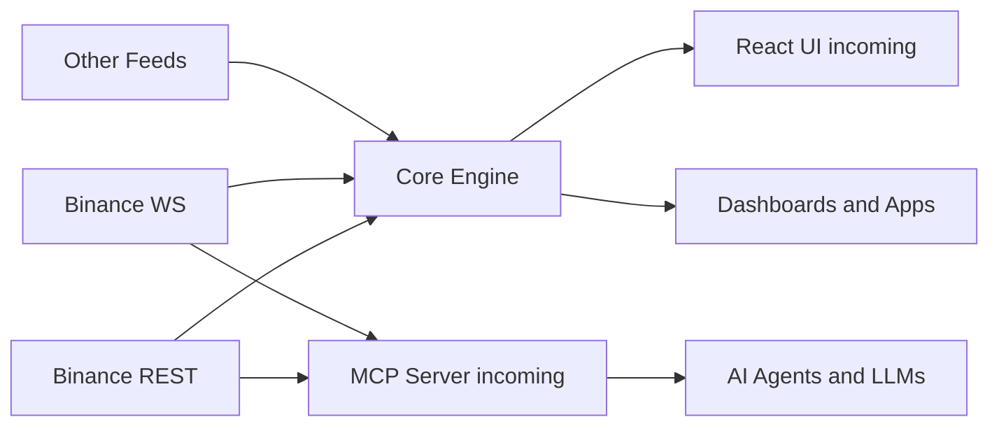
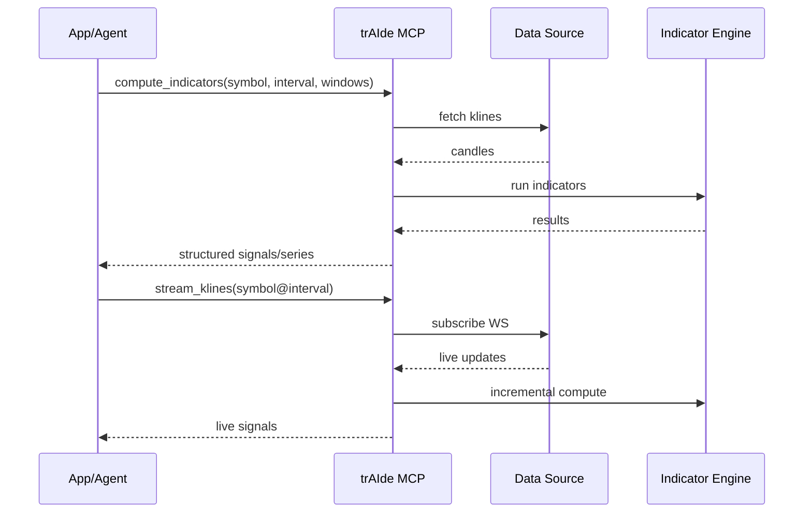

# trAIde — AI‑Ready Technical Analysis Toolkit


TypeScript-first technical analysis indicators, a faithful port of Python `ta` with modern DX for Node.js and browsers. Pure functions, strict types, tree-shakable, with streaming calculators for real-time apps.

What is trAIde?
- 🚀 Enterprise‑grade technical analysis for TypeScript — built for AI workflows, modern web apps, and trading automation.
- 🧠 Combines a comprehensive indicator engine, real‑time streaming calculators, React UI components (incoming), and an MCP Server (incoming) to power LLM‑driven agents and dashboards.

Why teams choose trAIde
- 📦 Comprehensive indicators: trend, momentum, volatility, volume — aligned with Python ta
- ⚡ Real‑time: streaming calculators for low‑latency updates
- 🧩 React UI (incoming): drop‑in overlays/panes for rapid dashboards
- 🤖 MCP Server (incoming): Model Context Protocol to expose tools to AI agents
- ✅ Quality: parity‑tested vs fixtures, ~98% coverage, strict types, tree‑shakable builds
- 🌐 Browser + Node: zero native deps; fast deque‑based rolling windows

Install (Core)
```bash
npm install traide
```

Links & Technical Docs
- 📘 Technical Analysis Engine: DOCUMENTATION-TA.md
- 🧩 React UI Components: DOCUMENTATION-REACT.mc
- 🤝 MCP Server (Model Context Protocol): DOCUMENTATION-MCP.md
Core package name is currently `tats` while the repo is trAIde. We’ll publish under the trAIde scope when packaging is finalized.

Quality & Parity
- 🧪 Tests mirror Python `ta` fixtures; tight tolerances
- 📈 Coverage: ~98% statements/lines, 100% functions, ~89% branches
- 📚 Full surface and examples: docs/API.md

Indicator Coverage (selected)
- Trend: SMA, EMA, MACD (+signal/diff), TRIX, Mass Index, Ichimoku (+display helpers), STC, DPO, KST, Aroon, Vortex, PSAR
- Momentum: RSI, Stochastic, StochRSI (+%K/%D), KAMA, TSI, Ultimate Oscillator, Williams %R, Awesome Osc, PPO/PVO
- Volatility: ATR, Bollinger (mavg/high/low/width/%B + cross indicators), Keltner (original + EMA/ATR), Donchian, Ulcer Index
- Volume: OBV, ADL, CMF, Force Index, Ease of Movement (+SMA), VPT (+smoothed), NVI, MFI, VWAP, Chaikin Oscillator
- Others: Daily/Log/Cumulative Returns

Architecture at a glance



MCP Server interaction



Docs
- 📘 API reference: docs/API.md
- 🔬 Engine details: DOCUMENTATION-TA.md
- 🧩 React library: DOCUMENTATION-REACT.mc
- 🤝 MCP server: DOCUMENTATION-MCP.md

Roadmap (Near‑Term)
- ✅ Finalize parity sweep and defaults vs Python `ta`
- 🧩 React UI component library (overlays/panes, hooks)
- 🤝 MCP Server to integrate indicators with AI agents
- 📊 Demo app: historical + live Binance (REST + WebSocket)
- 📚 Typedoc site, examples, strategy cookbook

Contributing
- Run lint, typecheck, tests:
  ```bash
  npm run lint && npm run typecheck && npm test
  ```
- PRs welcome for additional fixtures, indicators, and docs.

License
- MIT

Stargazers over time

[](https://star-history.com/#Independent-AI-Labs/trAIde&Date)
